# Click Count application

[](https://travis-ci.org/xebia-france/click-count)

Sommaire
=================

<!--ts-->

- [Introduction, Description du travail effectué](#introduction)
   * [Présentation Générale](#présentation-générale)
   * [Description du contenu du repository](#description-du-contenu-du-repository)
- [Préliminaires](#préliminaires)
- [Installation](#installation)
- [Suppression](#suppression)
- [Notes & Remarques](#notes--remarques)

---

# Introduction, Description du travail effectué

## Présentation Générale

Implémentation de l'exercice avec :

1. des environnements basés sur des clusters EKS et Elasticache Redis, 
2. une pipeline utilisant Github Actions et Helm
3. Infra as Code, avec: 
   1. `Terraform` pour une partie de la configuration de Github Actions
   2. `CloudFormation` pour le reste de l'infra

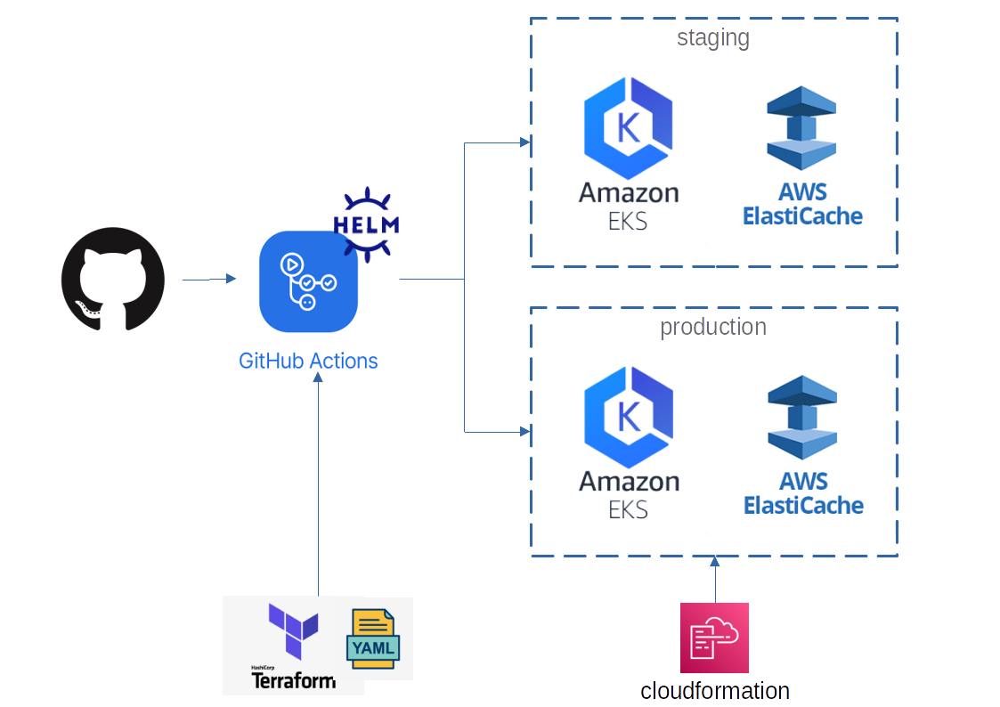

## Description du contenu du repository


```shell
.
├── .github                         # pipeline Github Actions
├── deploy                          # le chart Helm pour déployer l'application
├── docs                            # des images pour le README
├── infra                           # le code d'infra Cloudformation et Terraform (pipeline)
├── docker-compose.yml              # pour lancer l'application localement
├── Makefile                        # des targets pour construire l'infra
├── props.env                       # des props à modifier pour la création de l'infra
├── src                             # code "de prod" et "de test" de l'application Java
├── ...
└── README.md

```

# Préliminaires

Pour pouvoir déployer l'infra, il faut:
1. make: [https://www.gnu.org/software/make/](https://www.gnu.org/software/make/)
2. aws cli: [https://docs.aws.amazon.com/cli/latest/userguide/install-cliv2.html](https://docs.aws.amazon.com/cli/latest/userguide/install-cliv2.html)
3. eksctl: [https://eksctl.io/](https://eksctl.io/)
4. terraform [https://www.terraform.io/downloads](https://www.terraform.io/downloads)
5. Générer un token d'accès Github avec les paramètres suivants (permissions à ajuster)

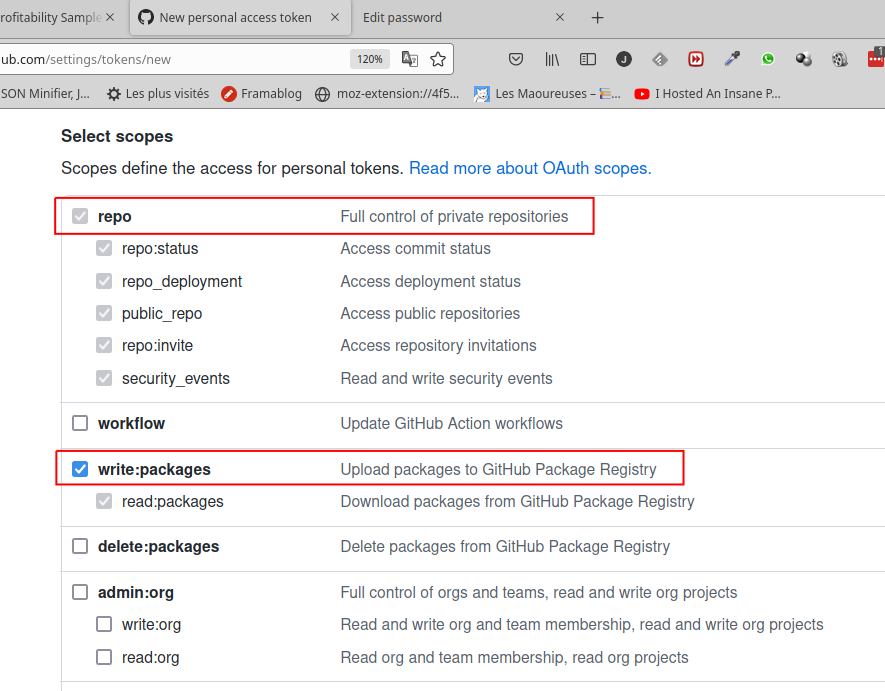

# Installation

1. Forker le repo
2. Modifier le fichier `props.env` 

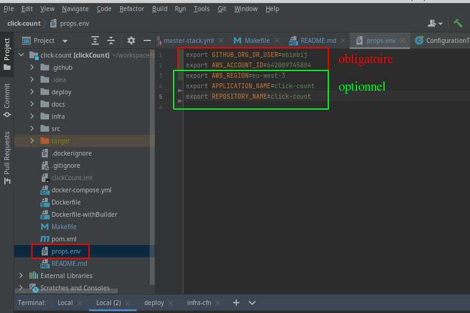

3. Installez l'infra et les paramètres de la pipeline avec le token d'accès Github en variable d'environnement (cf section [Préliminaires](#Préliminaires)) 

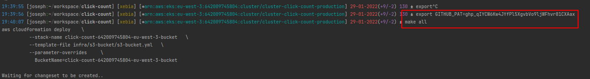

(Le token a été changé pour le screenshot)

Le token d'accès n'est pas rajouté à `props.env` afin de ne pas le commiter par erreur. De plus quand Github détecte un token d'accès dans le code source, il l'invalide automatiquement.

4. Les environnements et secrets dans Github Actions devraient être créés

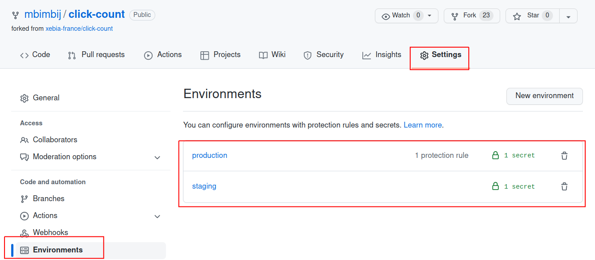

5. Au bout d'un certain temps (20-30 minutes), les environnements devraient être créés dans AWS

les stacks `CloudFormation`:

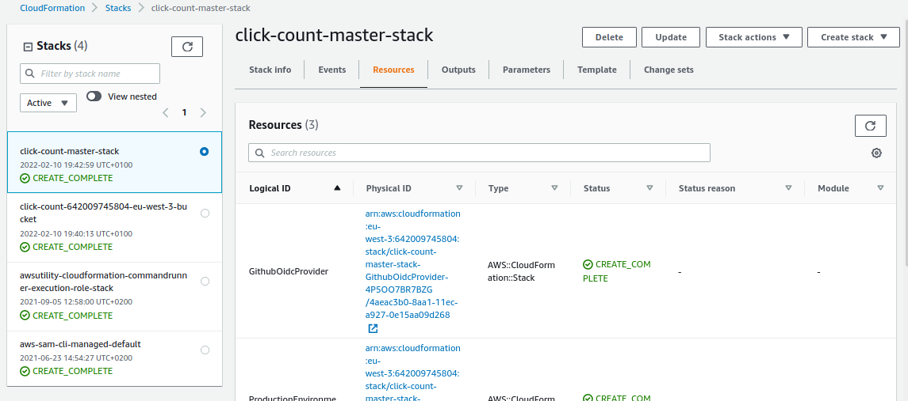

les clusters EKS de staging et prod:

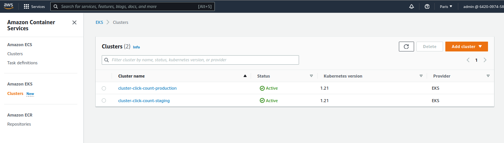

les clusters Elasticache / Redis de staging et prod:

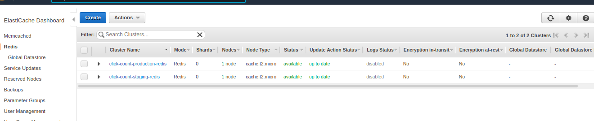

le provider OIDC pour permettre à Github Actions de déployer dans nos cluster EKS (assez pratique):

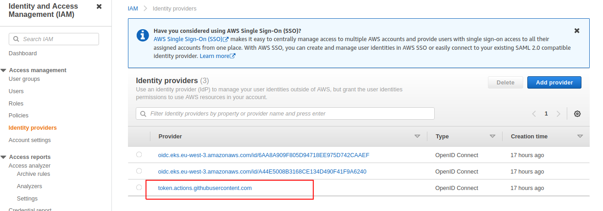

Ainsi que les rôles, permissions et autres ressources.

6. Poussez du code dans `src` ou `pom.xml` pour faire éxécuter la pipeline si elle ne s'éxécute pas toute seule

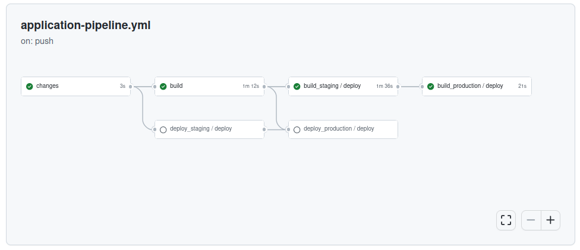

Le pipeline a été définie pour ne builder l'application et construire une image Docker que si le code de l'app est modifié.
Si uniquement le chart Helm est modifié, l'application est redéployée avec le chart à jour et le tag de l'image Docker la plus récente, mais n'est pas rebuildée.  

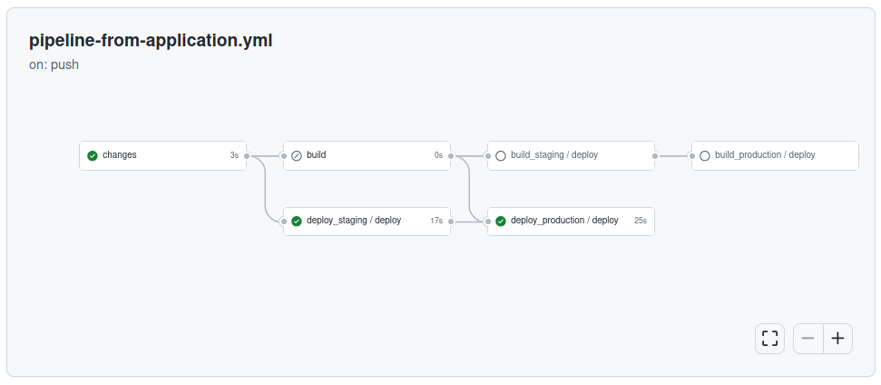

7. Récupérer les urls des Load Balancer sur chaque environnment et vérifiez que tout marche bien

```shell
13:27:25 >> aws eks list-clusters 
{
    "clusters": [
        "cluster-click-count-production",
        "cluster-click-count-staging"
    ]
}
13:27:27 >> aws eks update-kubeconfig --name cluster-click-count-staging
Updated context arn:aws:eks:eu-west-3:642009745804:cluster/cluster-click-count-staging in /home/joseph/.kube/config
13:27:41 >> k -n click-count get svc
NAME          TYPE           CLUSTER-IP       EXTERNAL-IP                                                               PORT(S)        AGE
click-count   LoadBalancer   172.20.253.162   a4cb99ab0f0ce4191b751fa629600f36-1170078537.eu-west-3.elb.amazonaws.com   80:32714/TCP   5m16s
13:27:54 >> aws eks update-kubeconfig --name cluster-click-count-production
Updated context arn:aws:eks:eu-west-3:642009745804:cluster/cluster-click-count-production in /home/joseph/.kube/config
13:28:05 >> k -n click-count get svc
NAME          TYPE           CLUSTER-IP       EXTERNAL-IP                                                               PORT(S)        AGE
click-count   LoadBalancer   172.20.232.105   a68d2fe242da8404692205ec7bd83b6d-1779255576.eu-west-3.elb.amazonaws.com   80:32263/TCP   4m27s

```

(Rajoutez `/clickCount` à l'url -> root contexte de l'app dans Tomcat)


# Suppression

Toujours avec le token d'accès Github dans la variable d'environnement `GITHUB_PAT`, éxécutez:

```shell
make delete-all
```

# Notes & Remarques

1. Le build échoue initialement -> il faut ajouter une version plus récente du plugin maven `maven-war-plugin`

```log
[ERROR] Failed to execute goal org.apache.maven.plugins:maven-war-plugin:2.2:war (default-war) on project clickCount: Execution default-war of goal org.apache.maven.plugins:maven-war-plugin:2.2:war failed: Unable to load the mojo 'war' in the plugin 'org.apache.maven.plugins:maven-war-plugin:2.2' due to an API incompatibility: org.codehaus.plexus.component.repository.exception.ComponentLookupException: Cannot access defaults field of Properties
[ERROR] -----------------------------------------------------
[ERROR] realm =    plugin>org.apache.maven.plugins:maven-war-plugin:2.2
[ERROR] strategy = org.codehaus.plexus.classworlds.strategy.SelfFirstStrategy
```

2. Implémenter des déploiement "safe": rajouter des tests automatisés après le déploiement avec rollback automatique et canary / déploiement progressif (Flagger semble être l'outil de choix pour cela)
3. On peut vouloir préférer un modèle "pull" pour le déploiement dans Kube, ne serait-ce que pour éviter à donner accès aux clusters depuis l'extérieur et utiliser un outil tel que par exemple FluxCD, ArgoCD ou autre. Mais il n'est pas toujours facile de suivre le déploiement
4. Pour des applis et projets simples, on pourrait vouloir se tourner vers une solution totalement managée, type heroku, Google App Engine, AWS App Runner (avec des réserves pour ce dernier).
5. L'infra existant a priori de manière indépendante de l'app (et pouvant être utilisée par plusieurs apps), on pourrait vouloir la mettre dans son propre repository. Cependant, les charts Helm devraient rester avec le code de l'app
6. L'infra est déployée depuis le laptop. Il serait plus approprié de définir une pipeline pour la mise à jour de celle-ci
7. Je n'ai pas été complètement emballé par Github Actions, au moins il a le mérite d'être managé.
8. Pour le cluster Redis: plutôt un service managé ou bien dans le cluster Kube ?
9. Des ressources non-managées par `CloudFormation` sont créées par EKS et causent des soucis pour clean l'infra, forçant à introduire des scripts (ou des lambdas éventuellement) pour les cleaner.
10. On peut avoir des arguments contre une "master-stack" de toute l'infra. C'est pratique de pouvoir créer toute l'infra, sans scotch, via un seul `aws cloudformation deploy` et la supprimer via une seul `aws cloudformation delete-stack`, mais ça se discute  
11. Sur certains aspects, notamment les tests ou encore la documentation de l'éxécution en locale
